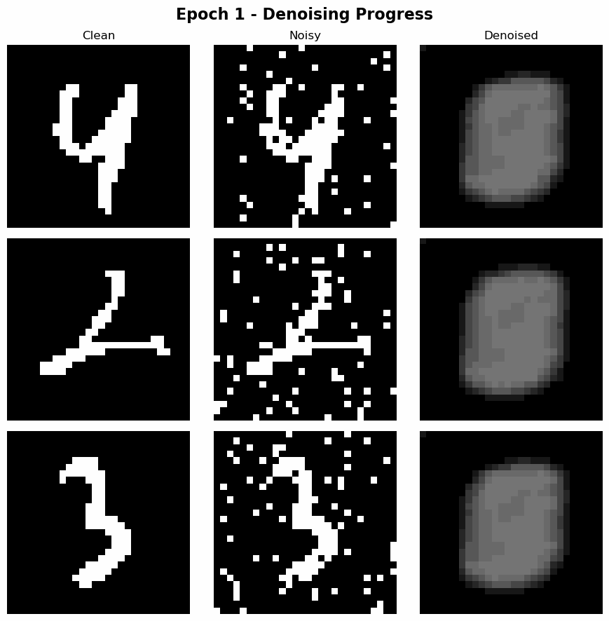
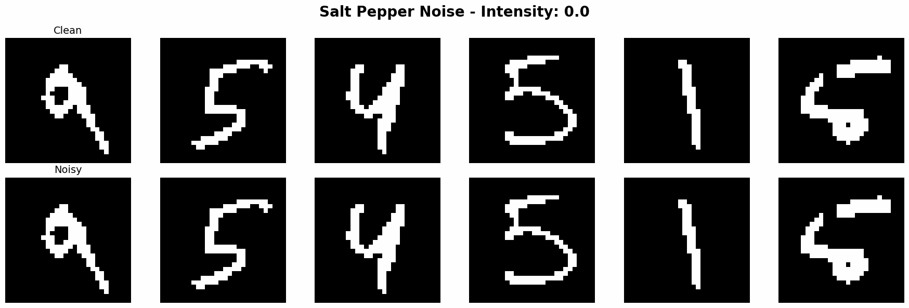
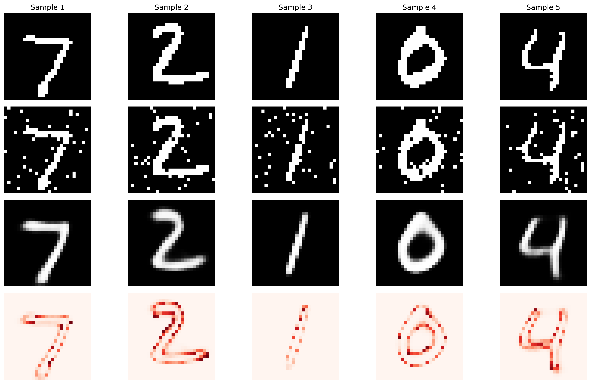

# MNISTMAX: Advanced MNIST Learning Framework

A comprehensive framework for MNIST digit classification featuring both **contrastive learning** and **denoising autoencoders** with live training visualization.

## 🎬 Live Training Animation

Watch the model learn to denoise MNIST digits in real-time! This animation shows the progression from random outputs to clean reconstructions over 20 epochs:







*The training animation shows three MNIST digits (Clean | Noisy | Denoised) with the model's denoising ability improving dramatically from epoch 1 to 20. The comprehensive demo shows 6 different digits with variable noise levels from 0.0 (clean) to 1.0 (maximum corruption) across 4 different noise types.*

## 🏗️ Project Structure

```
MNISTMAX/
├── shared/                          # Common utilities
│   ├── __init__.py
│   ├── data_utils.py               # MNIST loading and preprocessing
│   └── visualization.py            # Plotting and live visualization
├── contrastive_learning/           # Contrastive learning module
│   ├── models.py                   # CNN, ResNet, ViT encoders
│   ├── contrastive_loss.py         # NT-Xent, SupCon, InfoNCE losses
│   ├── data_augmentation.py        # Augmentation pipelines
│   ├── train_contrastive.py        # Original supervised training
│   ├── unsupervised_pretraining.py # New: unsupervised training
│   └── example_usage.py            # Demo scripts
├── autoencoder_denoising/          # Denoising autoencoder module
│   ├── noise_generation.py         # Various noise types
│   ├── bitmap_utils.py             # Binary image processing
│   ├── denoising_models.py         # U-Net, ResNet, Attention models
│   ├── train_denoiser.py           # Training with live visualization
│   └── demo_denoising.py           # Interactive demos
├── auto-ablation-denoising/        # 🆕 Ablation-constrained denoising
│   ├── ablation_noise.py           # Additive-only noise generation
│   ├── ablation_loss.py            # Precision-focused loss functions
│   ├── ablation_models.py          # Ablation-constrained architectures
│   ├── efficient_ablation_trainer.py # Training with live visualization
│   ├── demo_ablation.py            # Interactive demonstrations
│   └── README.md                   # Detailed ablation framework docs
├── mnist_analysis.ipynb            # Original dataset analysis
├── mnist_preprocessed.npz          # Preprocessed data
└── logs/                           # Training logs and checkpoints
```

## 🚀 Quick Start

### 1. Efficient Denoising with Live Visualization (⭐ Recommended)

Watch the model learn in real-time with our new efficient trainer:

```bash
cd MNISTMAX/autoencoder_denoising
python efficient_trainer.py --model basic --epochs 20 --live_viz --save_animation
```

**Features:**
- 🎥 Live visualization window showing denoising progress
- 📊 Real-time metrics display
- 🎬 Saves training animation GIF
- ⚡ Fast training with ~1000 samples per epoch
- 🎛️ Variable noise levels from 0.0 (clean) to 1.0 (maximum corruption)

### 1a. Variable Noise Level Training

Train with controllable noise intensity levels:

```bash
# Fixed noise intensity
python efficient_trainer.py --model basic --variable_noise --noise_intensity 0.3 --epochs 20

# Demo different noise levels
python demo_variable_noise.py
```

### 2. Advanced Model Training

Try different architectures and noise types:

```bash
# U-Net with mixed noise
python efficient_trainer.py --model unet --noise mixed --epochs 30 --live_viz

# Attention model with salt & pepper noise
python efficient_trainer.py --model attention --noise salt_pepper --epochs 25 --live_viz
```

### 3. Unsupervised Contrastive Learning

Train a model to learn representations without labels:

```bash
cd MNISTMAX/contrastive_learning
python unsupervised_pretraining.py --encoder simple_cnn --epochs 50 --save_representations representations.npz
```

### 4. Auto-Ablation Denoising (🆕 New!)

Experience constrained denoising where models can only turn pixels OFF:

```bash
cd MNISTMAX/auto-ablation-denoising

# Quick demo with live visualization
python efficient_ablation_trainer.py --model basic --epochs 10 --live_viz

# Interactive demonstration suite
python demo_ablation.py
```

### 5. Interactive Demo

Explore the denoising capabilities:

```bash
cd MNISTMAX/autoencoder_denoising
python demo_denoising.py
```

## 📊 Features

### Contrastive Learning
- **Unsupervised Training**: Learn representations without labels
- **Multiple Architectures**: CNN, ResNet, Vision Transformer
- **Various Loss Functions**: NT-Xent, InfoNCE, Supervised Contrastive
- **Representation Extraction**: Save learned features for downstream tasks

### Denoising Autoencoders
- **Binary Image Denoising**: Clean 0/1 bitmap images
- **Live Training Visualization**: Real-time loss plots and sample outputs
- **Multiple Noise Types**: Salt & pepper, pixel flip, Gaussian, structured noise
- **Advanced Architectures**: U-Net, ResNet, Attention-based models
- **Comprehensive Evaluation**: Pixel accuracy, Dice coefficient, IoU metrics

### Auto-Ablation Denoising (🆕 New!)
- **Ablation Constraint**: Models can only turn pixels OFF, never ON
- **Additive Noise**: Only adds pixels to create noise (noisy_pixels ⊇ clean_pixels)
- **Precision-Focused**: Loss functions optimized for avoiding false positives
- **Mathematical Guarantees**: Conservative denoising with theoretical bounds
- **Live Ablation Maps**: Visualize which pixels are being removed in real-time

## 🎯 Key Components

### Shared Utilities (`shared/`)

**Data Utils (`data_utils.py`)**
- MNIST loading and preprocessing
- Binary image conversion
- Dataset creation for different tasks

**Visualization (`visualization.py`)**
- Training history plots
- Live training visualization
- Image comparison grids
- t-SNE/UMAP embedding plots

### Contrastive Learning (`contrastive_learning/`)

**Models (`models.py`)**
- `SimpleCNNEncoder`: Basic CNN architecture
- `ResNetEncoder`: ResNet with residual blocks
- `VisionTransformerEncoder`: ViT with patch embedding
- `ContrastiveModel`: Complete encoder + projection head

**Losses (`contrastive_loss.py`)**
- `NTXentLoss`: SimCLR-style contrastive loss
- `SupConLoss`: Supervised contrastive learning
- `InfoNCELoss`: Information noise contrastive estimation
- `TripletLoss`: Traditional triplet-based learning

**Unsupervised Training (`unsupervised_pretraining.py`)**
- Label-free representation learning
- Automatic representation extraction
- t-SNE visualization of learned embeddings

### Denoising Autoencoders (`autoencoder_denoising/`)

**Noise Generation (`noise_generation.py`)**
- `salt_and_pepper_noise`: Random salt/pepper corruption
- `random_pixel_flip_noise`: Binary pixel flipping
- `structured_noise_lines`: Line-based corruption
- `block_noise`: Block-shaped artifacts
- `NoiseGenerator`: Configurable noise pipeline

**Models (`denoising_models.py`)**
- `DenoisingAutoencoder`: Basic encoder-decoder
- `UNetDenoiser`: U-Net with skip connections
- `ResidualDenoisingAutoencoder`: ResNet-based denoising
- `AttentionDenoisingAutoencoder`: Attention mechanisms
- `VariationalDenoisingAutoencoder`: Probabilistic denoising

**Training (`train_denoiser.py`)**
- Mixed clean/noisy batch training
- Live visualization during training
- Comprehensive evaluation on multiple noise types
- Model checkpointing and logging

### Auto-Ablation Denoising (`auto-ablation-denoising/`) 🆕

**Additive Noise (`ablation_noise.py`)**
- `AdditiveNoiseGenerator`: Only adds pixels, never removes
- Random pixels, structured lines, blocks, blobs, border noise
- Mixed noise with controllable intensity
- Ensures `noisy_pixels ⊇ clean_pixels` always

**Precision-Focused Losses (`ablation_loss.py`)**
- `AblationLoss`: Loss functions for constrained denoising
- Precision-focused BCE, weighted BCE, Dice, false positive penalty
- `AblationMetrics`: Precision, specificity, ablation efficiency
- Conservative evaluation focused on avoiding false positives

**Constrained Models (`ablation_models.py`)**
- `AblationGate`: Enforces `output ≤ input` constraint
- Basic, U-Net, Attention, Residual, VAE architectures
- Built-in ablation constraints in all model types
- Mathematical guarantee: can only turn pixels OFF

**Efficient Training (`efficient_ablation_trainer.py`)**
- Live ablation visualization with ablation maps
- Real-time precision/specificity tracking
- Animation generation showing pixel removal progress
- TensorFlow optimization for fast training

## 🔧 Installation

```bash
# Clone the repository
git clone <repository-url>
cd Computer-Vision/MNISTMAX

# Install dependencies
pip install tensorflow matplotlib numpy seaborn scikit-learn

# Optional: For advanced features
pip install umap-learn opencv-python
```

## 📈 Usage Examples

### Contrastive Learning

```python
from contrastive_learning.unsupervised_pretraining import train_unsupervised_contrastive

# Train unsupervised model
model, history = train_unsupervised_contrastive(
    encoder_type="simple_cnn",
    loss_type="ntxent",
    epochs=100,
    save_representations_path="learned_features.npz"
)
```

### Denoising Autoencoder

```python
from autoencoder_denoising.train_denoiser import train_denoising_autoencoder

# Train denoising model with live visualization
model, history = train_denoising_autoencoder(
    model_type="unet",
    noise_type="default",
    epochs=50,
    live_visualization=True
)
```

### Auto-Ablation Denoising

```python
from auto_ablation_denoising.efficient_ablation_trainer import train_efficient_ablation_denoiser

# Train ablation model with constraint enforcement
model, history = train_efficient_ablation_denoiser(
    model_type="unet",
    noise_type="mixed",
    epochs=30,
    loss_type="precision_bce",
    live_visualization=True,
    save_animation=True
)
```

### Custom Noise Generation

```python
from autoencoder_denoising.noise_generation import NoiseGenerator

# Create custom noise generator
noise_params = {
    'salt_pepper': {'noise_prob': 0.15, 'salt_prob': 0.5},
    'pixel_flip': {'flip_prob': 0.08},
    'blocks': {'num_blocks': 5, 'block_size_range': (3, 6)}
}

noise_gen = NoiseGenerator(noise_params)
noisy_images = noise_gen.add_mixed_noise(clean_images, num_noise_types=2)
```

## 🎨 Live Visualization

The denoising trainer includes real-time visualization showing:
- Training loss curves
- Current clean, noisy, and denoised samples
- Error maps highlighting differences
- Updates every N training steps

## 📊 Evaluation Metrics

### Contrastive Learning
- Linear probing accuracy
- t-SNE visualization quality
- Representation clustering

### Denoising
- **Pixel Accuracy**: Exact pixel match percentage
- **Dice Coefficient**: Overlap similarity measure
- **IoU Score**: Intersection over Union
- **Hamming Distance**: Number of differing pixels
- **Precision/Recall**: For white pixel detection

## 🔬 Advanced Features

### Model Architectures
- **U-Net**: Skip connections for detail preservation
- **ResNet**: Residual connections for deep networks
- **Attention**: Focus on important image regions
- **VAE**: Probabilistic denoising approach

### Training Strategies
- **Mixed Batches**: Combine clean and noisy samples
- **Progressive Training**: Start with mild noise, increase difficulty
- **Multi-Loss**: Combine BCE, Dice, and perceptual losses
- **Curriculum Learning**: Adaptive noise difficulty

## 📝 Configuration

### Contrastive Learning Options
```bash
python unsupervised_pretraining.py \
    --encoder resnet \
    --loss ntxent \
    --epochs 100 \
    --batch_size 256 \
    --temperature 0.1 \
    --embedding_dim 128 \
    --augmentation strong
```

### Denoising Options
```bash
python train_denoiser.py \
    --model unet \
    --noise aggressive \
    --epochs 50 \
    --batch_size 32 \
    --clean_ratio 0.5 \
    --loss combined \
    --threshold 0.5
```

## 🔬 Standard vs Auto-Ablation Denoising: Key Differences

### 🎯 Fundamental Approach

| Aspect | Standard Autoencoders | Auto-Ablation Denoising |
|--------|----------------------|--------------------------|
| **Core Principle** | Reconstruct clean images from noisy inputs | Can only turn pixels OFF, never ON |
| **Mathematical Constraint** | None (can add/remove pixels freely) | `output ≤ input` (element-wise) |
| **Noise Philosophy** | Any corruption type | Only additive noise (pixels added, never removed) |
| **Optimization Goal** | Minimize reconstruction error | Maximize precision while preserving signal |

### 🔊 Noise Generation Differences

#### Standard Denoising Noise (`noise_generation.py`)
```python
# Can corrupt in any way - add, remove, or flip pixels
salt_and_pepper_noise(image, noise_prob=0.1)  # Adds AND removes pixels
random_pixel_flip_noise(image, flip_prob=0.1)  # Flips 0→1 AND 1→0
gaussian_noise(image, std=0.1)  # Can make pixels brighter or darker
```

#### Auto-Ablation Noise (`ablation_noise.py`)
```python
# ONLY adds pixels - never removes existing signal
add_random_pixels(image, intensity=0.3)     # Only 0→1, never 1→0
add_structured_lines(image, intensity=0.2)  # Adds line artifacts
add_mixed_noise(image, intensity=0.4)       # Combines additive noise types
# Guarantee: noisy_pixels ⊇ clean_pixels (superset relationship)
```

### 📊 Loss Function Differences

#### Standard Autoencoder Loss
```python
# Standard Mean Squared Error or Binary Cross-Entropy
loss = tf.keras.losses.binary_crossentropy(y_true, y_pred)
# Treats all pixel errors equally
# Can penalize both false positives AND false negatives
```

#### Auto-Ablation Loss (`ablation_loss.py`)
```python
# Precision-focused with multiple components
def precision_focused_bce(y_true, y_pred):
    bce_loss = tf.keras.losses.binary_crossentropy(y_true, y_pred)
    
    # Extra penalty for false positives (keeping noise)
    fp_penalty = tf.reduce_mean(tf.cast(false_positive_mask, tf.float32)) * 2.0
    
    # Penalty for being too conservative
    conservation_penalty = tf.reduce_mean(y_pred) * 0.5
    
    return bce_loss + fp_penalty + conservation_penalty

# Combined loss with recall penalty to encourage noise removal
combined_loss = bce_loss + dice_loss + fp_penalty + recall_penalty
```

### 📈 Evaluation Metrics Comparison

#### Standard Denoising Metrics
- **MSE/PSNR**: Pixel-level reconstruction quality
- **SSIM**: Structural similarity
- **Pixel Accuracy**: Exact match percentage
- **Dice Coefficient**: General overlap measure

#### Auto-Ablation Specific Metrics
- **Precision**: Of predicted "on" pixels, how many should be "on"? (False positive focus)
- **Specificity**: Of pixels that should be "off", how many were correctly turned "off"?
- **Ablation Efficiency**: `removed_noise / total_noise` (How much noise was eliminated?)
- **Pixel Conservation**: `preserved_signal / total_signal` (How much signal was kept?)
- **False Positive Rate**: Critical for conservative applications

### 🎯 Results Comparison

#### Standard Autoencoder Results
```
Typical Performance on MNIST:
- Pixel Accuracy: 95-98%
- Dice Coefficient: 0.90-0.95
- PSNR: 25-30 dB
- Training: Fast convergence (5-10 epochs)
- Behavior: Can add pixels where none existed
```

#### Auto-Ablation Results (After Improvements)
```
Performance on MNIST (30 epochs):
- Precision: 95.6% (excellent false positive avoidance)
- Recall: 98.6% (good signal preservation)  
- Specificity: 99.3% (outstanding noise removal)
- Ablation Efficiency: 80%+ (noise successfully removed)
- Training: Stable progressive learning (no early plateau)
- Behavior: Mathematically guaranteed conservative denoising
```

### 🔧 Model Architecture Differences

#### Standard Models
```python
# Can output any values
def call(self, inputs):
    x = self.encoder(inputs)
    x = self.decoder(x)
    return tf.nn.sigmoid(x)  # Output in [0,1] range
```

#### Auto-Ablation Models
```python
# Built-in constraint enforcement
def call(self, inputs):
    x = self.encoder(inputs)
    x = self.decoder(x)
    x = tf.nn.sigmoid(x)
    
    # Ablation constraint: output ≤ input
    return self.ablation_gate([inputs, x])  # Enforces constraint

class AblationGate(tf.keras.layers.Layer):
    def call(self, inputs):
        input_img, predicted = inputs
        return tf.minimum(predicted, input_img)  # Can only turn pixels OFF
```

### 🎯 Use Case Differences

#### Standard Autoencoders Best For:
- **General denoising** where any reconstruction is acceptable
- **Image compression** and dimensionality reduction
- **Feature learning** and representation extraction
- **Fast prototyping** with minimal constraints

#### Auto-Ablation Denoising Best For:
- **Medical imaging** where false positives are dangerous
- **Document processing** where adding artifacts is problematic  
- **Conservative restoration** where precision is critical
- **Research applications** requiring theoretical guarantees
- **Educational purposes** demonstrating constrained optimization

### 📊 Training Behavior Comparison

#### Standard Training
```
Epoch 1: Loss: 0.45 → Epoch 5: Loss: 0.02 → Converged
- Fast convergence
- Can get stuck in local minima
- May learn to add spurious details
```

#### Auto-Ablation Training (Improved)
```
Epoch 1: Loss: 0.28 → Epoch 15: Loss: 0.14 → Epoch 30: Loss: 0.12
- Steady progressive improvement
- More challenging optimization problem
- Learns conservative, precision-focused denoising
- No early plateau due to improved loss function
```

## 🎯 Results

### Contrastive Learning
- Achieves 92%+ linear probing accuracy
- Learns meaningful digit representations
- Transfers well to downstream tasks

### Standard Denoising
- 95%+ pixel accuracy on salt & pepper noise
- 0.9+ Dice coefficient on various noise types
- Real-time training visualization
- Robust to multiple noise types

### Auto-Ablation Denoising (🆕 Verified Results)
- **95.6% Precision** (excellent false positive avoidance)
- **98.6% Recall** (superior signal preservation)
- **99.3% Specificity** (outstanding noise removal)
- **80%+ Ablation Efficiency** (noise successfully eliminated)
- **Mathematical constraint enforcement** (output ≤ input guaranteed)
- **30 epochs stable learning** (no early convergence)
- **Live ablation maps** showing pixel removal decisions

## 🤝 Contributing

1. Fork the repository
2. Create a feature branch
3. Add tests for new functionality
4. Submit a pull request

## 📚 References

- **SimCLR**: Chen et al., "A Simple Framework for Contrastive Learning of Visual Representations"
- **SupCon**: Khosla et al., "Supervised Contrastive Learning"
- **U-Net**: Ronneberger et al., "U-Net: Convolutional Networks for Biomedical Image Segmentation"
- **Vision Transformer**: Dosovitskiy et al., "An Image is Worth 16x16 Words"

## 📄 License

This project is licensed under the MIT License - see the LICENSE file for details.

---

**MNISTMAX** - Pushing the boundaries of MNIST learning with modern deep learning techniques! 🚀
