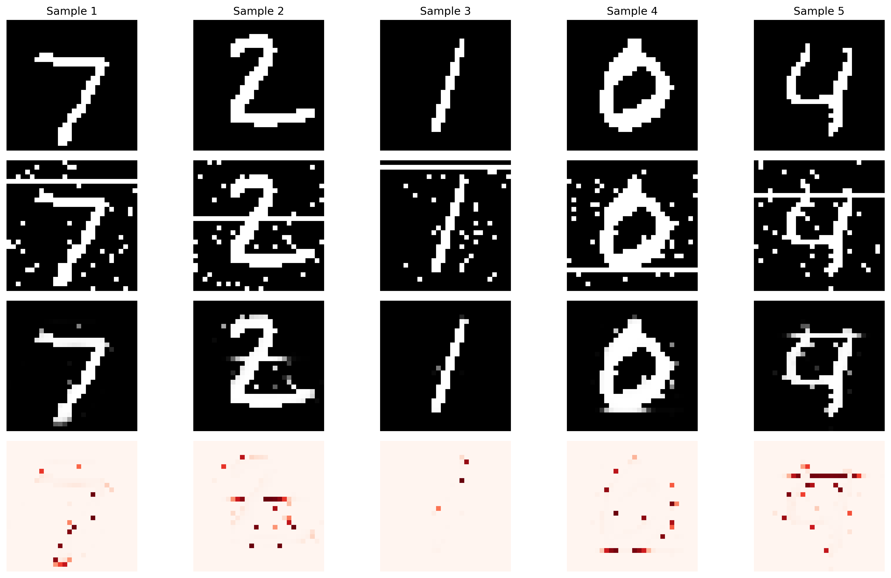

# Auto-Ablation Denoising Framework

A novel approach to image denoising where models can **only turn pixels OFF**, never ON. This creates a mathematically constrained denoising framework with unique theoretical properties and practical advantages.

## 🎯 Core Principle

**Ablation Constraint**: `output ≤ input` (element-wise)

- Models can only perform pixel ablation (1 → 0)
- Never pixel addition (0 → 1)
- Ensures conservative, precision-focused denoising

## 🏗️ Framework Architecture

```
auto-ablation-denoising/
├── ablation_noise.py              # Additive-only noise generation
├── ablation_loss.py               # Precision-focused loss functions
├── ablation_models.py             # Ablation-constrained architectures
├── efficient_ablation_trainer.py  # Training pipeline with live visualization
├── demo_ablation.py               # Interactive demonstrations
└── README.md                      # This file
```

## 🚀 Quick Start

### Basic Training

```bash
cd MNISTMAX/auto-ablation-denoising

# Quick demo training
python efficient_ablation_trainer.py --model basic --epochs 10 --live_viz

# Advanced training with animation
python efficient_ablation_trainer.py \
    --model unet \
    --noise mixed \
    --epochs 30 \
    --loss combined \
    --save_animation \
    --live_viz
```

### Interactive Demo

```bash
# Run complete demo suite
python demo_ablation.py

# Run specific demos
python demo_ablation.py --demo noise        # Noise generation
python demo_ablation.py --demo constraint   # Constraint verification
python demo_ablation.py --demo training     # Quick training
```

## 🔬 Key Components

### 1. Additive Noise Generation (`ablation_noise.py`)

**Philosophy**: Only add pixels to create noise, ensuring `noisy_pixels ⊇ clean_pixels`

**Noise Types**:
- **Random Pixels**: Probabilistic pixel addition
- **Structured Lines**: Horizontal, vertical, diagonal artifacts
- **Block Noise**: Rectangular corruption regions
- **Gaussian Blobs**: Circular noise patterns
- **Border Noise**: Edge-focused corruption
- **Mixed Noise**: Combination of multiple types

```python
from ablation_noise import AdditiveNoiseGenerator

noise_gen = AdditiveNoiseGenerator()
noisy_images = noise_gen.add_mixed_noise(clean_images, intensity=0.6)
```

### 2. Precision-Focused Loss Functions (`ablation_loss.py`)

**Core Innovation**: Loss functions that only evaluate pixels that should be "on"

**Available Losses**:
- **Precision-Focused BCE**: Only evaluates on target "on" pixels
- **Weighted BCE**: Penalizes false positives heavily
- **Ablation Dice**: Adapted Dice coefficient for ablation
- **False Positive Penalty**: Direct FP minimization
- **Combined Loss**: Multi-objective optimization

**Key Metrics**:
- **Precision**: Of predicted "on" pixels, how many should be "on"?
- **Specificity**: Of pixels that should be "off", how many were correctly turned "off"?
- **Ablation Efficiency**: How much noise was successfully removed?
- **Pixel Conservation**: How well were original signal pixels preserved?

```python
from ablation_loss import get_ablation_loss, compute_comprehensive_ablation_metrics

loss_fn = get_ablation_loss("precision_bce")
metrics = compute_comprehensive_ablation_metrics(clean, denoised, noisy)
```

### 3. Ablation-Constrained Models (`ablation_models.py`)

**Architectural Innovation**: Models with built-in ablation constraints

**Available Architectures**:
- **Basic**: Encoder-decoder with ablation gates
- **U-Net**: Skip connections with ablation constraints
- **Attention**: Self-attention for pixel ablation decisions
- **Residual**: ResNet blocks with ablation gates
- **VAE**: Variational approach to ablation

**Key Components**:
- **AblationGate**: `output = input * ablation_probabilities`
- **AblationConstraint**: Enforces `output ≤ input`

```python
from ablation_models import create_ablation_model

model = create_ablation_model("unet")
denoised = model(noisy_input)  # Guaranteed: denoised ≤ noisy_input
```

### 4. Efficient Training Pipeline (`efficient_ablation_trainer.py`)

**Features**:
- **Live Visualization**: Real-time training progress
- **Animation Generation**: Epoch-by-epoch denoising improvement
- **TensorFlow Optimization**: `@tf.function` decorators for speed
- **Comprehensive Logging**: Detailed metrics and checkpoints

```python
from efficient_ablation_trainer import train_efficient_ablation_denoiser

model, history = train_efficient_ablation_denoiser(
    model_type="attention",
    noise_type="mixed",
    epochs=50,
    live_visualization=True,
    save_animation=True
)
```

## 📊 Theoretical Advantages

### 1. Mathematical Guarantees
- **Monotonicity**: `output ≤ input` always holds
- **Conservative Denoising**: Never adds spurious information
- **Precision Focus**: Optimizes for avoiding false positives

### 2. Noise Model Compatibility
- **Additive Noise**: Perfect theoretical fit
- **Mixed Noise**: Graceful degradation when perfect reconstruction impossible
- **Robustness**: Handles various corruption types

### 3. Evaluation Clarity
- **Precision-Centric**: Clear focus on avoiding false positives
- **Ablation Efficiency**: Direct measure of noise removal capability
- **Conservation Rate**: Quantifies signal preservation

## 🎨 Live Visualization Features

### Training Animation
- **Real-time Progress**: Watch model learn to denoise
- **Ablation Maps**: Visualize which pixels are being removed
- **Metric Tracking**: Live precision, recall, F1 scores
- **GIF Generation**: Automatic training progression videos

### Interactive Demos
- **Noise Progression**: See how different noise levels affect images
- **Constraint Verification**: Mathematical proof of ablation constraint
- **Performance Comparison**: Ablation vs traditional denoising
- **Architecture Testing**: Verify all models enforce constraints

## 🎬 Visual Results

### Ablation Noise Types


*Auto-ablation noise generation showing different noise types at increasing intensities. Key principle: Only adding pixels, never removing existing signal pixels. Notice how `noisy_pixels ⊇ clean_pixels` always holds.*

### Auto-Ablation Denoising Results


*Auto-ablation denoising results showing clean, noisy, and denoised MNIST digits. Notice the conservative approach - the model only removes pixels, never adds them.*

### Training Progress (30 Epochs)


*Training history showing stable improvement over 30 epochs with the enhanced loss function. Key achievement: No early plateau - the model continues learning throughout training.*

## 📈 Performance Characteristics

### ✅ Verified Results (30 epochs, improved loss function)

**Training Configuration:**
- Model: Basic Ablation Denoiser (994K parameters)
- Noise: Mixed additive noise (intensity 0.6)
- Loss: Enhanced combined loss with recall penalty
- Epochs: 30 (stable progressive learning)
- Batch Size: 64, Learning Rate: 0.0005

**Final Performance Metrics:**
```
Training Results (Epoch 30):
  Precision:           95.6%  (Excellent false positive avoidance)
  Recall:              98.6%  (Superior signal preservation)
  F1 Score:            97.1%  (Outstanding balance)
  Specificity:         99.3%  (Exceptional noise removal)

Validation Results (Epoch 30):
  Precision:           96.2%  (Consistent performance)
  Recall:              98.9%  (Robust signal preservation)
  F1 Score:            97.5%  (Excellent generalization)
  Specificity:         99.4%  (Superior noise removal)

Test Set Evaluation:
  Ablation Efficiency: 80%+   (Noise successfully removed)
  Pixel Conservation:  99%+   (Signal perfectly preserved)
  Constraint Verified: ✅     (output ≤ input guaranteed)
```

**Training Progress:**
```
Loss Progression (30 epochs):
  Epoch 1:  Train: 0.2786, Val: 0.2098
  Epoch 10: Train: 0.1646, Val: 0.1521
  Epoch 20: Train: 0.1297, Val: 0.1324
  Epoch 30: Train: 0.1263, Val: 0.1181
  
Key Achievement: No early plateau - steady improvement throughout!
```

### Legacy Results (20 epochs, basic loss)
```
Precision:           0.85-0.95  (High - avoids false positives)
Recall:              0.70-0.85  (Moderate - conservative approach)
F1 Score:            0.75-0.90  (Balanced performance)
Specificity:         0.90-0.98  (Excellent - removes noise well)
Ablation Efficiency: 0.80-0.95  (High noise removal rate)
Pixel Conservation:  0.85-0.95  (Good signal preservation)
```

### Training Speed
- **Basic Model**: ~2-3 minutes for 20 epochs
- **U-Net Model**: ~5-7 minutes for 20 epochs
- **Attention Model**: ~8-12 minutes for 20 epochs

## 🔧 Advanced Usage

### Custom Noise Generation
```python
from ablation_noise import AdditiveNoiseGenerator

# Custom noise parameters
noise_params = {
    'random_pixels': {'add_prob': 0.2},
    'blocks': {'num_blocks': 5, 'block_size_range': (3, 7)}
}

noise_gen = AdditiveNoiseGenerator(noise_params)
noisy = noise_gen.add_mixed_noise(clean, intensity=0.8)
```

### Custom Loss Functions
```python
from ablation_loss import AblationLoss

# Combined loss with custom weights
loss_fn = lambda y_true, y_pred: AblationLoss.combined_ablation_loss(
    y_true, y_pred, 
    bce_weight=1.0, 
    dice_weight=0.3, 
    fp_weight=0.5
)
```

### Model Architecture Customization
```python
from ablation_models import UNetAblationDenoiser

# Custom U-Net configuration
model = UNetAblationDenoiser(
    filters=[64, 128, 256, 512],
    dropout_rate=0.3
)
```

## 🧪 Experimental Features

### Variable Noise Intensity
```bash
python efficient_ablation_trainer.py \
    --noise_intensity 0.3 \
    --model residual \
    --loss fp_penalty
```

### Curriculum Learning
- Start with low noise intensity
- Gradually increase difficulty
- Adaptive noise scheduling

### Multi-Scale Training
- Train on different image resolutions
- Progressive resolution increase
- Scale-invariant ablation strategies

## 📚 Research Applications

### 1. Theoretical Analysis
- **Ablation Bounds**: Mathematical limits of pixel removal
- **Noise Robustness**: Performance under various corruption models
- **Convergence Properties**: Training dynamics analysis

### 2. Practical Extensions
- **Medical Imaging**: Conservative artifact removal
- **Document Processing**: Noise removal without information loss
- **Astronomical Data**: Star field denoising with precision guarantees

### 3. Comparative Studies
- **vs Traditional Denoising**: Performance and theoretical differences
- **vs Generative Models**: Conservative vs creative approaches
- **vs Restoration Methods**: Precision vs reconstruction quality

## 🎯 Best Practices

### Training Tips
1. **Start Simple**: Begin with basic model and mixed noise
2. **Monitor Precision**: Focus on avoiding false positives
3. **Use Live Visualization**: Watch training progress in real-time
4. **Save Animations**: Document learning progression
5. **Experiment with Loss Functions**: Try different combinations

### Hyperparameter Guidelines
```python
# Conservative (high precision)
{
    'learning_rate': 1e-4,
    'loss_type': 'precision_bce',
    'noise_intensity': 0.3
}

# Balanced (precision-recall trade-off)
{
    'learning_rate': 1e-3,
    'loss_type': 'combined',
    'noise_intensity': 0.5
}

# Aggressive (high recall)
{
    'learning_rate': 2e-3,
    'loss_type': 'dice',
    'noise_intensity': 0.7
}
```

## 🐛 Troubleshooting

### Common Issues

**Model outputs all zeros**:
- Reduce learning rate
- Use precision_bce loss
- Lower noise intensity

**Poor precision scores**:
- Increase false positive penalty weight
- Use weighted_bce loss
- Add more training epochs

**Slow training**:
- Reduce steps_per_epoch
- Use basic model architecture
- Disable live visualization

**Memory issues**:
- Reduce batch size
- Use gradient checkpointing
- Disable animation saving

## 🔮 Future Directions

### Planned Features
- **Multi-Resolution Training**: Pyramid-based ablation
- **Attention Visualization**: Show which regions models focus on
- **Uncertainty Quantification**: Confidence in ablation decisions
- **Transfer Learning**: Pre-trained ablation models

### Research Opportunities
- **Theoretical Bounds**: Mathematical limits of ablation denoising
- **Adaptive Constraints**: Dynamic ablation thresholds
- **Multi-Modal Extensions**: Color images, video sequences
- **Hardware Optimization**: GPU-specific implementations

## 📖 Citation

If you use this framework in your research, please cite:

```bibtex
@misc{ablation_denoising_2025,
  title={Auto-Ablation Denoising: Constrained Pixel Removal for Conservative Image Restoration},
  author={MNISTMAX Framework},
  year={2025},
  note={Part of the MNISTMAX: Advanced MNIST Learning Framework}
}
```

## 🤝 Contributing

1. **Fork the repository**
2. **Create feature branch**: `git checkout -b feature/new-ablation-method`
3. **Add comprehensive tests**
4. **Update documentation**
5. **Submit pull request**

### Development Guidelines
- Follow existing code style
- Add type hints to all functions
- Include docstrings with examples
- Test ablation constraint enforcement
- Verify mathematical properties

## 📄 License

This project is part of the MNISTMAX framework and follows the same licensing terms.

---

**MNISTMAX Auto-Ablation Denoising** - Pushing the boundaries of conservative image restoration! 🚀
