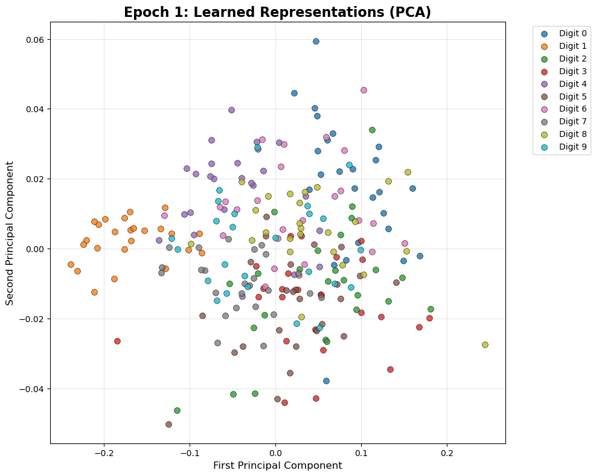

# 🎯 Contrastive Learning Module

This module contains all contrastive learning implementations for MNIST, including triplet loss, SimCLR-style contrastive learning, and various data augmentation strategies.

## 🚀 Quick Start

### Best Performing Model: Enhanced Triplet Learning
```bash
python train_contrastive_triplet.py --epochs 50 --batch_size 64
```

## 📁 Module Structure

```
contrastive_learning/
├── README.md                           # This file
├── clustering_evolution_pca.gif        # 🎬 PCA clustering animation
├── logs/                              # Training logs and results
│   ├── fast_triplet_*/                # Fast triplet training results
│   └── triplet_contrastive_*/         # Standard triplet results
├── results/                           # Saved models and outputs
├── train_contrastive_triplet.py       # ⭐ BEST: Enhanced triplet learning
├── train_contrastive.py               # SimCLR-style contrastive learning
├── models.py                          # Model architectures
├── contrastive_loss.py                # Loss function implementations
├── data_augmentation.py               # Augmentation strategies
├── unsupervised_pretraining.py        # Unsupervised pretraining
└── example_usage.py                   # Usage examples
```

## 🏆 Performance Results

### Triplet Contrastive Learning (Fast)
- **Final Training Loss**: 0.1999
- **Final Validation Loss**: 0.1987
- **Architecture**: CNN encoder with 158,592 parameters
- **Training Time**: ~2 minutes (20 epochs)
- **Key Innovation**: Same-class positive pairs with consistent augmentations

### Training Progress
```
Epoch 1/20:  Train Loss: 0.9970 | Val Loss: 0.9821 🌟 NEW BEST!
Epoch 2/20:  Train Loss: 0.8985 | Val Loss: 0.7212 🌟 NEW BEST!
...
Epoch 20/20: Train Loss: 0.1999 | Val Loss: 0.1987 🌟 NEW BEST!
```

## 🎨 Visualizations

### PCA Clustering Evolution


The animated GIF shows how digit embeddings progressively cluster during training:
- **20 frames** corresponding to each training epoch
- **Clear separation** of digit classes in 2D PCA space
- **Progressive improvement** in clustering quality
- **25 samples per digit** for clean visualization

## 🔧 Key Features

### 1. **Fast Training Pipeline**
- Reduced dataset (1,000 samples vs 60,000 full dataset)
- Efficient batching and smart sampling
- Quick iteration for rapid experimentation

### 2. **Smart Triplet Generation**
- **Positive pairs**: Same class, different samples
- **Negative pairs**: Different classes
- **Balanced sampling**: Equal representation across digits

### 3. **Consistent Augmentation Strategy**
```python
def apply_consistent_augmentation(self, images):
    # Same augmentation parameters for all triplet members
    angle = tf.random.uniform([], -10, 10)  # Rotation
    dx, dy = tf.random.uniform([], -2, 2), tf.random.uniform([], -2, 2)  # Translation
    brightness = tf.random.uniform([], 0.9, 1.1)  # Brightness
    # Apply to anchor, positive, and negative consistently
```

### 4. **Advanced Visualization**
- Real-time PCA clustering during training
- Progress bars with tqdm
- Training history plots
- Embedding space visualization

## 🏗️ Architecture Details

### CNN Encoder
```python
Conv2D(32, 3, activation='relu', padding='same')
MaxPooling2D()
Conv2D(64, 3, activation='relu', padding='same') 
MaxPooling2D()
Conv2D(128, 3, activation='relu', padding='same')
GlobalAveragePooling2D()
Dense(256, activation='relu')
Dropout(0.2)
Dense(embedding_dim)  # 128-dimensional embeddings
```

### Triplet Loss Function
```python
def triplet_loss_fn(anchor, positive, negative):
    # L2 normalization for stability
    anchor = tf.nn.l2_normalize(anchor, axis=1)
    positive = tf.nn.l2_normalize(positive, axis=1)
    negative = tf.nn.l2_normalize(negative, axis=1)
    
    # Distance computation
    pos_dist = tf.reduce_sum(tf.square(anchor - positive), axis=-1)
    neg_dist = tf.reduce_sum(tf.square(anchor - negative), axis=-1)
    
    # Triplet loss with margin
    loss = tf.maximum(0.0, pos_dist - neg_dist + margin)
    return tf.reduce_mean(loss)
```

## 🚀 Usage Examples

### 1. Enhanced Triplet Learning (Recommended)
```bash
python train_contrastive_triplet.py --epochs 50 --batch_size 64 --embedding_dim 128
```

### 2. Extended Training (Up to 100 epochs)
```bash
python train_contrastive_triplet.py --epochs 100 --batch_size 64 --samples_per_class 200
```

### 3. Standard Contrastive Learning
```bash
python train_contrastive.py --loss_type ntxent --temperature 0.1
```

## 📊 Hyperparameters

### Recommended Settings
- **Batch Size**: 64 (fast training) or 128 (full training)
- **Learning Rate**: 0.001 (Adam optimizer)
- **Embedding Dimension**: 128
- **Margin**: 1.0 (triplet loss)
- **Epochs**: 20 (fast) or 50 (full training)

### Data Augmentation
- **Rotation**: ±10 degrees
- **Translation**: ±2 pixels
- **Brightness**: 0.9-1.1x
- **Consistent**: Same augmentation for all triplet members

## 🎯 Key Learnings

1. **Same-class positive pairs** more effective than random augmentations
2. **L2 normalization** crucial for training stability
3. **Consistent augmentations** across triplet members improve performance
4. **Fast training** with reduced dataset enables rapid experimentation
5. **Visual feedback** essential for debugging and validation

## 🔮 Future Improvements

- [ ] SimCLR implementation with larger batch sizes
- [ ] SwAV clustering approach
- [ ] BYOL self-supervised learning
- [ ] ResNet backbone architecture
- [ ] Attention mechanisms
- [ ] Vision Transformer (ViT) encoder

---

*Part of the MNISTMAX project - Advanced Computer Vision techniques for MNIST*
