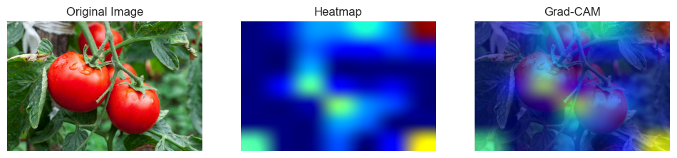
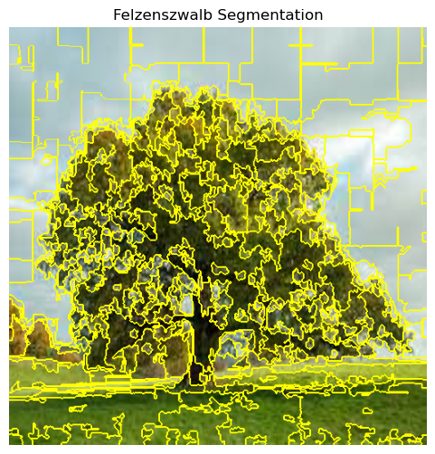

Computer Vision Repository
==========================

Welcome to the Computer Vision Repository! This repository features a collection of comprehensive guides and notebooks demonstrating the application of advanced computer vision techniques. Below is an overview of the projects included in this repository, along with direct links for immediate access and use.

## Setup Instructions

### Prerequisites
```bash
pip install -r requirements.txt
```

### Quick Setup
Run the setup script to create necessary directories and get data download instructions:
```bash
python setup_data.py
```

### Data Setup
This repository requires external datasets that are not included in version control due to their large size (2GB+). Please follow the data acquisition instructions for each project below.

Projects
--------

### 1\. Grad-CAM: Unifying Visualization, Agriculture, and Learning Dynamics

**Description:** This project consolidates three applications of Gradient-weighted Class Activation Mapping (Grad-CAM) into a comprehensive exploration of visualization techniques within deep learning. It demonstrates Grad-CAM's versatility in interpreting CNN decisions across varied contexts: standard image classification, agricultural produce classification, and visualizing model learning evolution.

**Data Requirements:**
- **Dataset:** Fruit and Vegetable Image Recognition
- **Source:** [Kaggle Dataset](https://www.kaggle.com/datasets/kritikseth/fruit-and-vegetable-image-recognition)
- **Size:** ~2GB
- **Setup Instructions:**
  1. Download the dataset from Kaggle
  2. Extract to `GradCamAgriculture/AgriClassificationData/`
  3. Ensure the folder structure matches: `train/`, `test/`, `validation/` with subfolders for each class

**Highlights:**

1.  **Core Grad-CAM Techniques**: Introduces Grad-CAM with a practical TensorFlow tutorial, focusing on visualizing CNN focus areas through heatmaps.
2.  **Agricultural Application**: Extends Grad-CAM to classify fruits and vegetables, illustrating its utility in specialized data analysis.
3.  **Learning Visualization**: Transforms static Grad-CAM outputs into dynamic videos, showcasing model training progress and decision refinement.

The project offers a holistic view of Grad-CAM's utility, combining foundational knowledge, sector-specific application, and innovative learning visualization to enhance model interpretability and application insight.

* [Basic Gradcam Usage](GradCamAgriculture/GradCam.ipynb)
* [Custom CNN with GradCam](GradCamAgriculture/Veggi_Classification.ipynb)
* [Generate Videos](GradCamAgriculture/VisualizeGradcamLearning.ipynb)




### 2\. Advanced Image Segmentation Techniques

**Description:** Explores various image segmentation methods to partition images into distinct segments or regions. Techniques covered include SLIC, Felzenszwalb's method, Quickshift, Watershed, and Mean Shift segmentation, with comparisons on effectiveness across different image types.

**Data Requirements:**
- **Setup:** Create an `image_segmentation_images/` directory
- **Add your own test images** or use any sample images (JPEG/PNG format)
- **Recommended:** Images with clear objects/regions for better segmentation results

[View Project](image_segmentation.ipynb)




### 3\. Feature Extraction from Floral and Fungi Footage

**Description:** Features lectures and timelapse footage of flora and fungi, demonstrating feature extraction techniques from video data. Includes detailed analysis of time-lapse videos of tomatoes and mushrooms, offering practical insights into video-based data analysis.

*   **Lecture on Feature Extraction:** [Watch Lecture](https://www.youtube.com/watch?v=7TCIeCOCHMc)
[](https://www.youtube.com/watch?v=7TCIeCOCHMc)

*   **Tomato Time-lapse Analysis:** [Watch Tomato Timelapse](https://www.youtube.com/watch?v=Y8SaA25KlVk)
[](https://www.youtube.com/watch?v=Y8SaA25KlVk)

*   **Mushroom Detection from Footage:** [Watch Mushroom Detection](https://www.youtube.com/watch?v=zauNC9Wd6cg)
[](https://www.youtube.com/watch?v=zauNC9Wd6cg)


### 4\. Anonymized Facial Expression: Dynamic Blurring with Superpixel Segmentation

**Description:** This project demonstrates a novel approach to facial anonymization, integrating superpixel segmentation with dynamic blurring to preserve facial expressions. Through practical Python implementations, it achieves real-time anonymization of faces in static images or video streams without sacrificing the expressiveness of facial features. Leveraging OpenCV for robust face detection and skimage for advanced segmentation, the project illustrates a sophisticated method to balance privacy and emotional conveyance.

**Data Requirements:**
- **Test Images:** Add your own portrait images to the `faceblur/` directory
- **Formats:** JPEG, PNG supported
- **Recommendations:** Clear frontal face images work best
- **Privacy:** Only use images you have permission to process

[View Project](faceblur/faceblur.ipynb)


### 5\. MNISTMAX: Advanced MNIST Learning Framework

**Description:** A comprehensive framework demonstrating cutting-edge deep learning techniques on MNIST, featuring both contrastive learning and denoising autoencoders with live training visualization. Watch models learn in real-time through animated training progressions and achieve state-of-the-art performance on binary image denoising tasks.

**Data Requirements:**
- **Built-in Dataset:** Uses MNIST (automatically downloaded)
- **No External Data:** Self-contained with TensorFlow/Keras
- **Quick Setup:** Ready to run out of the box

**Highlights:**

1. **Live Training Visualization**: Watch models learn epoch-by-epoch with real-time denoising improvements
2. **Advanced Architectures**: U-Net, ResNet, Attention-based, and Variational autoencoders
3. **Efficient Training**: Optimized data pipelines with on-the-fly noise generation
4. **Comprehensive Evaluation**: Multiple metrics including Dice coefficient and IoU scores

**Quick Start:**
```bash
cd MNISTMAX/autoencoder_denoising
python efficient_trainer.py --model basic --epochs 20 --live_viz --save_animation
```

[View Full Project](MNISTMAX/)


*Watch the model learn to denoise MNIST digits in real-time - from random outputs to clean reconstructions!*

## Repository Structure

```
Computer-Vision/
├── README.md
├── .gitignore
├── requirements.txt (recommended to create)
├── image_segmentation.ipynb
├── Felzenszwalb_seg.png
├── faceblur/
│   ├── faceblur.ipynb
│   ├── blurred_zuck.png (sample output)
│   └── [your test images here]
├── GradCamAgriculture/
│   ├── GradCam.ipynb
│   ├── Veggi_Classification.ipynb
│   ├── VisualizeGradcamLearning.ipynb
│   ├── gradCamApplied.png
│   └── AgriClassificationData/ (download separately)
│       ├── train/
│       ├── test/
│       └── validation/
├── MNISTMAX/
│   ├── README.md
│   ├── shared/ (common utilities)
│   ├── contrastive_learning/ (unsupervised learning)
│   ├── autoencoder_denoising/ (denoising with live viz)
│   ├── mnist_analysis.ipynb
│   └── logs/ (training results and animations)
└── image_segmentation_images/ (create and add your images)
```

## Contributing

When contributing to this repository:
1. Do not commit large datasets or model files
2. Update the .gitignore if adding new data directories
3. Include data acquisition instructions for any new datasets
4. Test notebooks with sample data before committing

## License

Please respect the licenses of the external datasets used in these projects.
